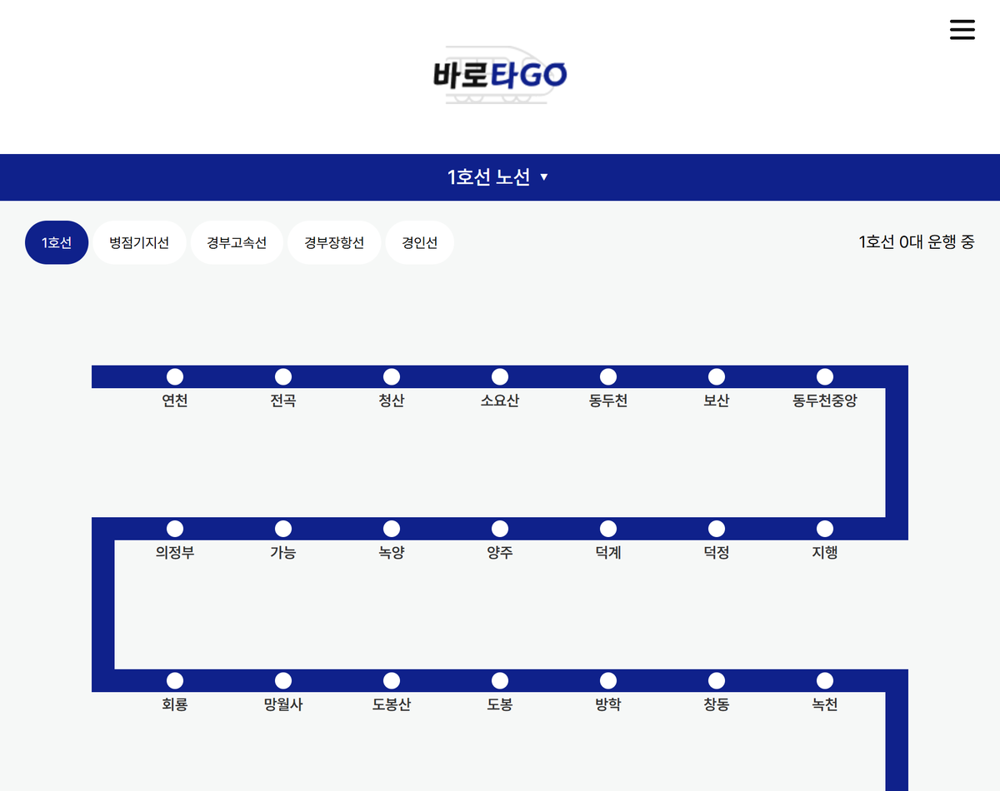
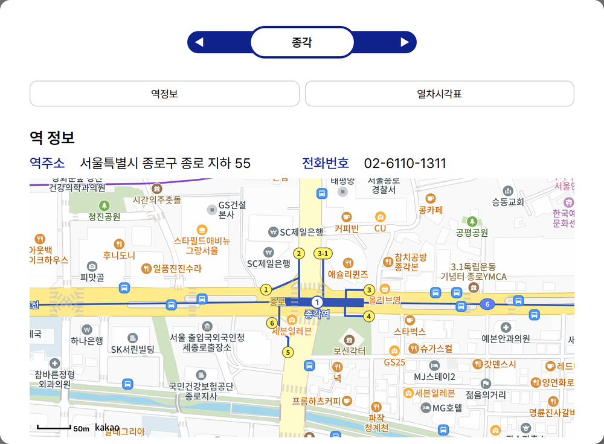
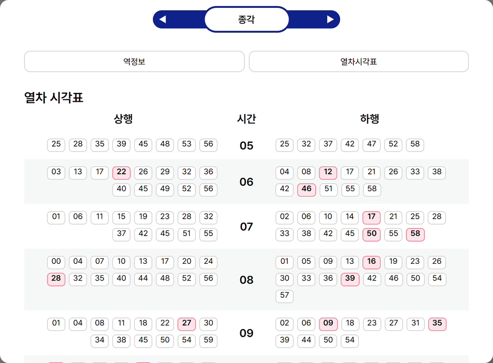

# 바로타고 (Barotago)

> 수도권 지하철 노선도에서 역을 고르면 역 정보·편의시설·시간표를 한 화면에서 확인하는 지하철 정보 서비스입니다.

| 구분 | 내용 |
| --- | --- |
| 개발 기간 | 2025.10 ~ 2026.01 (2026.06 DAO 계층 리팩토링) |
| 인원 | 1명 (개인 프로젝트, 기획·디자인·프론트·백엔드·데이터 수집 전담) |
| 상태 | 개발 중 — 실시간 도착 정보는 백엔드 API까지, 경로 검색은 화면 틀까지 구현 |

## 주요 화면
> 로컬 환경(개발 당시 DB)에서 실행해 캡처했습니다.

| 노선도 | 역 정보 |
| --- | --- |
|  |  |
| 1호선 선택 시 지선 버튼과 지그재그 노선도 | 역을 누르면 주소·전화번호·Kakao 지도 표시 |

| 편의시설 | 열차 시간표 |
| --- | --- |
|  |  |
| 역별 편의시설 아이콘 | 시 단위 상행·하행 시간표, 급행 열차는 빨간색 표시 |

## 주요 기능

### 노선도 탐색
- 노선을 고르면 해당 노선의 역 목록을 **지그재그 노선도** 형태로 보여줍니다. 한 줄에 정해진 개수만큼 역을 배치하고, 줄마다 진행 방향을 바꿔 실제 노선처럼 이어지게 그립니다.
- 1호선처럼 지선·분기가 있는 노선은 **상위 노선 → 하위 노선** 순서로 선택합니다. (`service_lines`의 `parent_code`로 자기 참조)
- 노선마다 공식 색상(`color_hex`)을 DB에 두고 화면에 그대로 적용합니다.

### 역 상세
- 주소·전화번호와 Kakao 지도로 역 위치를 보여줍니다.
- 휠체어 충전기, 물품보관함, ATM, 무인 민원발급기, 수유실, 자전거 보관소 등 **편의시설을 아이콘**으로 보여줍니다.

### 열차 시간표
- 시(hour) 단위로 묶어 **상행·하행**을 나란히 보여주고, **급행 열차는 빨간색으로 구분**합니다.
- API는 평일·토요일·공휴일(`weekTag`)을 모두 지원하며, 화면은 현재 평일 시간표만 표시합니다.

### 실시간 도착 정보 (백엔드)
- 서울 열린데이터광장 실시간 도착정보 API를 서버에서 호출해, 역 이름으로 상·하행 도착 예정 열차를 반환합니다. 화면 연결은 다음 단계입니다.

## 기술 스택

| 영역 | 기술 |
| --- | --- |
| Backend | Java 17, Spring Boot 4.0, MyBatis, RestTemplate |
| Frontend | React 19, React Router 7, Axios, Kakao Map API |
| Database | MySQL |
| Data | Python (requests, pandas, pymysql), 서울 열린데이터광장 Open API |

## 구조

```text
[수집 스크립트 (Python)]                     [서비스]
 서울 열린데이터 API · 공공 CSV                React ──▶ Spring Boot ──▶ MySQL
   └─ 정제 → CSV → MySQL 적재 ─────────────────────────────▲      │
                                                                  └─▶ 서울 실시간 도착 API
```

- **자주 바뀌지 않는 데이터**(역·노선·편의시설·시간표)는 Python 스크립트로 미리 수집해 DB에 넣고, 서비스는 DB만 조회합니다.
- **계속 바뀌는 데이터**(실시간 도착)만 요청 시점에 외부 API를 호출합니다.
- 백엔드는 `controller → service → dao(MyBatis)` 계층으로 나누고, DAO를 인터페이스와 MyBatis 구현체로 분리했습니다.

```text
backend/src/main/java/com/barotago/backend/
├── subway/      # 노선·노선별 역 목록·실시간 도착
├── station/     # 역 상세·편의시설
├── timetable/   # 열차 시간표
└── config/      # CORS 등 웹 설정
datas/           # 공공데이터 수집·정제·적재 스크립트
frontend/        # React
```

## API

| Method | URL | 설명 |
| --- | --- | --- |
| GET | `/api/subway/lines` | 상위 노선 목록 |
| GET | `/api/subway/lines/{lineCode}/children` | 하위 노선(지선·분기) 목록 |
| GET | `/api/subway/lines/{lineCode}/stations` | 노선별 역 목록 (운행 순서) |
| GET | `/api/subway/realtime?stationName=` | 실시간 도착 정보 |
| GET | `/api/stations/{stationId}` | 역 상세 |
| GET | `/api/stations/{stationId}/facilities` | 역 편의시설 |
| GET | `/api/stations/{stationCd}/timetable?weekTag=` | 시간표 (1 평일 · 2 토요일 · 3 공휴일) |

## 데이터 수집

| 스크립트 | 내용 |
| --- | --- |
| `station_script.py` | 역·노선·노선별 역 순서 CSV를 정제해 `station`, `service_lines`, `service_line_station`에 적재 |
| `process_amenities.py` / `station_amenities_script.py` | 역별 편의시설 정리 후 적재 |
| `process_timetable.py` | 역 × 요일(3) × 방향(2) 조합으로 시간표 API를 호출해 CSV로 저장 |
| `station_timetable_script.py` | 시간표 CSV를 `station_timetable`에 적재 |

## 실행 방법

### 환경 변수

인증 정보는 코드에 두지 않고 환경 변수로 주입합니다.

| 위치 | 변수 |
| --- | --- |
| backend | `DB_URL`, `DB_USERNAME`, `DB_PASSWORD`, `SEOUL_API_KEY` |
| datas (`.env`) | `DB_HOST`, `DB_USER`, `DB_PASSWORD`, `DB_NAME`, `DB_CHARSET`, `SEOUL_API_KEY` |
| frontend (`.env`) | `REACT_APP_KAKAO_MAP_KEY` |

### 실행

```bash
# 1. 데이터 적재 (최초 1회)
cd datas
python station_script.py
python station_amenities_script.py
python process_timetable.py && python station_timetable_script.py

# 2. 백엔드
cd backend && ./gradlew bootRun     # http://localhost:8080

# 3. 프론트엔드
cd frontend && npm install && npm start   # http://localhost:3000
```

## 개선 계획

**미구현 기능**
- 실시간 도착 정보 화면 연결
- 경로 검색 기능 구현 (현재 입력 화면만 있음)
- 시간표 요일 탭 연결 (API는 지원, 화면은 평일 고정) · 첫차/막차 시간표

**데이터 문제 (로컬 실행 중 발견)**
- 환승역 매핑 오류: `station_script.py`가 역 이름을 키로 `station_id`를 찾아서, 이름이 같은 환승역은 마지막에 읽은 노선의 역으로 덮어써짐 → 1호선 서울·시청·종로3가 등이 다른 노선의 역코드로 연결되어 시간표가 다르게 나옴. 이름 대신 역코드(노선+역) 기준으로 매핑해야 함
- 시간표 누락: 457개 역 중 397개 역만 시간표가 수집됨 (2호선 등 일부 노선 누락)
- 좌표 컬럼 반전: 적재 시 `lat`에 경도, `lng`에 위도가 들어가고, 화면에서 `LatLng(lng, lat)`로 다시 뒤집어 지도는 정상 표시됨 → 적재 단계에서 바로잡고 화면 코드도 원래 순서로 정리 필요

**코드 정리**
- 실시간 도착 API 실패 시 예외를 로그로만 남기고 빈 목록을 반환 → 실패 원인을 구분해 응답하도록 개선
- 시간표 급행 여부 컬럼 정리: 적재 시 원본 `EXPRESS_YN == "G"`를 `is_express = Y`로 저장하고, 조회 시 이 값을 다시 반대로 해석하는 이중 부정 구조라 컬럼 의미와 실제 값이 어긋남
- 테스트 코드 추가
